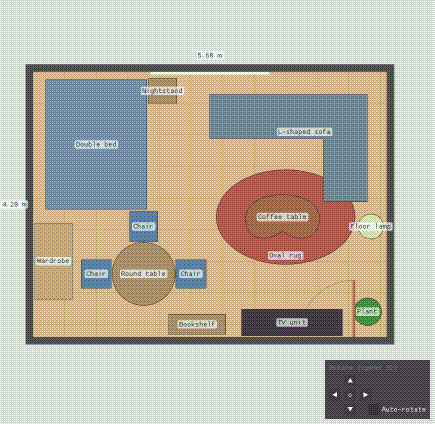
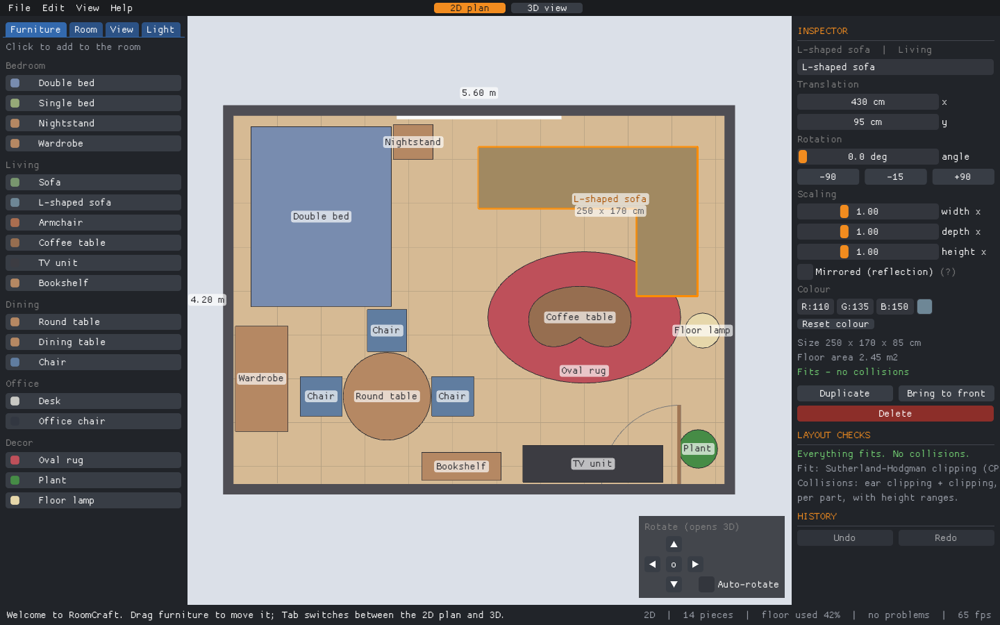
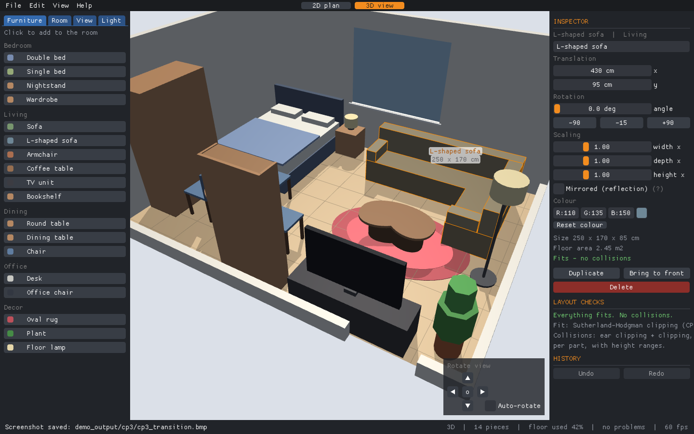
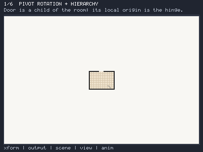
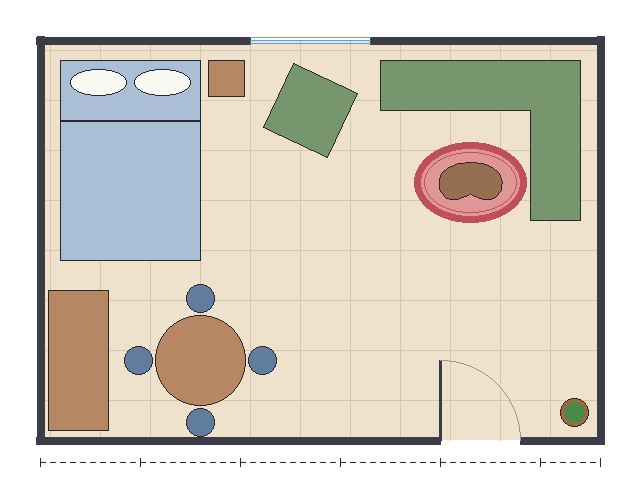
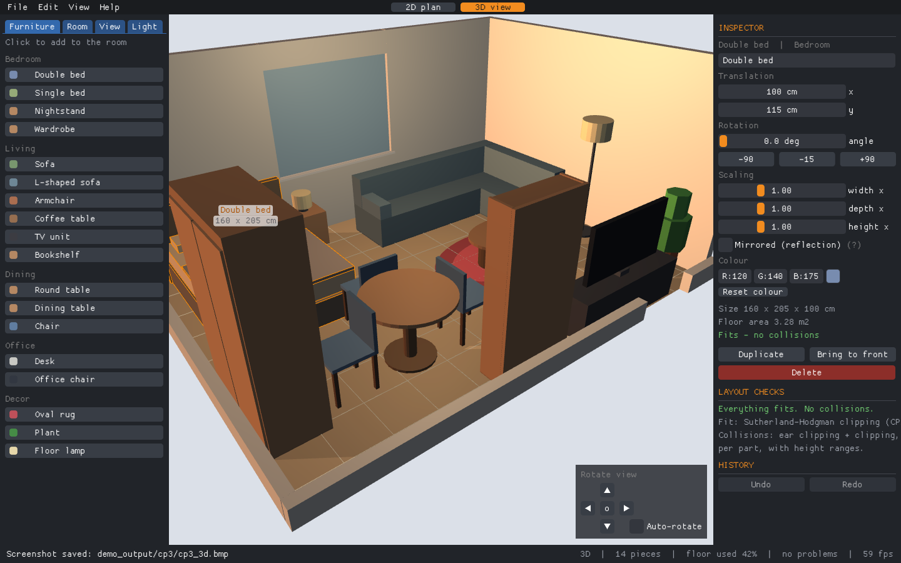
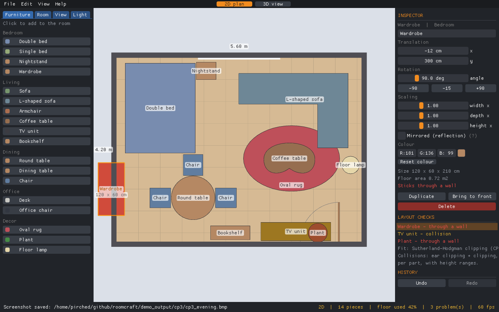

# RoomCraft

**RoomCraft** is a 2D-to-3D interior layout visualiser. Users lay out a room and
its furniture on a top-down 2D plan and see the same room, lit, in 3D.
Checkpoint 3 is an interactive OpenGL app: drag furniture on the plan, press
Tab, and the room rises into a 3D view you can orbit. It is built on the
algorithms of Checkpoints 1 and 2 (polygons, clipping, matrices, cameras,
easing, GIF encoding); the floor plan is still the single source of truth.



*`cp3_tour.gif`, recorded by the app itself: the 2D plan turns into the lit 3D
room, the camera orbits, and the view returns to the plan.*

| 2D plan (OpenGL) | 3D view |
|---|---|
|  |  |



*`showcase.gif` (22 s): the door opens, furniture arranges itself, a sofa is
mirrored into the room, the fan and vacuum animate, the 2D camera zooms, and
the plan is extruded into a 3D orbit reveal.*



*The complete floor plan written by `roomcraft_demo` (1 pixel = 1 cm, room 5.6 m × 4.0 m).*

---

## Group Members

| Name | GitHub |
|---|---|
| Victor Gichuru | [@victorgpt0](https://github.com/victorgpt0) |
| Tobiko Leriari | [@Leriari](https://github.com/Leriari) |
| Kristein Mwaura | [@Houstonsboy](https://github.com/Houstonsboy) |
| Emmanuel Oringe | [@eoringe](https://github.com/eoringe) |
| Joy Kipkemboi | [@Joychepchumba](https://github.com/Joychepchumba) |

---

## Technologies and tools

| | |
|---|---|
| Language | C++17. The CP1/CP2 libraries use the standard library only |
| Graphics API (CP3) | OpenGL 3.3 core profile, GLSL 330 shaders |
| Window and input (CP3) | [GLFW 3.4](https://www.glfw.org/), downloaded by CMake |
| User interface (CP3) | [Dear ImGui 1.91.9b](https://github.com/ocornut/imgui), downloaded by CMake |
| OpenGL loader (CP3) | [glad 0.1.36](https://github.com/Dav1dde/glad), generated code in `third_party/glad` |
| Build system | CMake ≥ 3.20 |
| Tests | CTest, with a small assertion helper ([tests/test_helpers.h](tests/test_helpers.h)) |
| Output | Binary PPM (P6), 24-bit BMP, GIF89a animations and bitmap text, written by our own code |
| Tested with | GCC 13.3.0 + CMake 3.28.3 on Pop!_OS 24.04 (Linux), Mesa radeonsi, OpenGL 4.6; also GCC 15.2 (MSYS2 UCRT64) + Ninja on Windows 11 in earlier CP2 work |
| Version control | Git / GitHub |

---

## Graphics techniques implemented

All coordinates are **screen coordinates**: the origin is the top-left corner,
x grows to the right and **y grows downward**. Integer coordinates are pixel
centres. Because y points down, positive angles turn **clockwise** on screen.
See [src/raster/types.h](src/raster/types.h).

| Technique | Algorithm | Source file | RoomCraft use |
|---|---|---|---|
| Line drawing | DDA | [line.cpp](src/raster/line.cpp) | Comparison with Bresenham |
| Line drawing | Bresenham / midpoint, integer-only, all 8 octants | [line.cpp](src/raster/line.cpp) | Every outline, grid line and wall |
| Line operations | Thick lines (perpendicular width), dashed lines, polylines | [line.cpp](src/raster/line.cpp) | Walls, dimension lines, furniture outlines |
| Line clipping | Cohen-Sutherland (region codes) | [line.cpp](src/raster/line.cpp) | Editor grid clipped to the room |
| Polygon representation | Ordered vertex list | [polygon.h](src/raster/polygon.h) | Furniture footprints, room outline |
| Polygon operations | Translate, rotate and scale about a pivot | [polygon.cpp](src/raster/polygon.cpp) | Moving, turning and resizing furniture |
| Polygon measurements | Shoelace area, area centroid, bounding box | [polygon.cpp](src/raster/polygon.cpp) | Floor-space statistics, selection boxes |
| Point in polygon | Even-odd ray casting | [polygon.cpp](src/raster/polygon.cpp) | Which piece of furniture was clicked |
| Polygon clipping | Sutherland-Hodgman | [clipping.cpp](src/raster/clipping.cpp) | Does the furniture fit inside the room? |
| Polygon filling | Scanline fill with an edge table and active edge table (even-odd, half-open rule) | [fill.cpp](src/raster/fill.cpp) | Solid furniture and floor; tiles without gaps or overlaps |
| Region filling | Boundary fill, 4-connected, explicit stack | [fill.cpp](src/raster/fill.cpp) | "Paint bucket" for floor zones |
| Circles | Midpoint circle with 8-way symmetry; filled disc | [circle.cpp](src/raster/circle.cpp) | Round tables, chairs, plant pots |
| Arcs | Midpoint circle limited to an angle range | [circle.cpp](src/raster/circle.cpp) | Door swings |
| Ellipses | Two-region midpoint ellipse with 4-way symmetry; filled ellipse | [ellipse.cpp](src/raster/ellipse.cpp) | Rugs, pillows |
| Bézier curves | Cubic Bézier: Bernstein form **and** de Casteljau | [curves.cpp](src/raster/curves.cpp) | Curved sofa, kidney-shaped coffee table |
| Splines | Catmull-Rom (passes through every point) | [curves.cpp](src/raster/curves.cpp) | Curtain track through clicked points |
| Splines (extra) | Uniform cubic B-spline (approximating) | [curves.cpp](src/raster/curves.cpp) | Smooth rounded outlines |
| Editor logic | `hitTest`, `findFurnitureAt`, `fitsInRoom` | [furniture.cpp](src/roomcraft/furniture.cpp) | Selecting furniture, flagging furniture that sticks through a wall |

Every algorithm is commented in its source file: what it does, why it works,
and how it fits the coordinate convention.

### More Notes

- **Bresenham** uses only integer additions and comparisons. One decision
  variable, derived in the comments, covers all eight octants using step
  directions `sx` and `sy`.
- **The scanline fill** recomputes each edge's x from the line equation on
  every row, instead of adding 1/slope each time as in the textbook version.
  Repeated float additions drift, and where an edge passes exactly through a
  pixel centre the drift can move a pixel by one. That would break the
  guarantee that neighbouring polygons neither overlap nor leave gaps, which
  the tests check.
- **The midpoint ellipse** traces region 1 from the top tip and region 2 from
  the side tip, splitting them at the slope = −1 point. The usual single-pass
  textbook loop put pixels up to a whole pixel off the curve on small or flat
  ellipses: 21-128 of the 3,600 sizes from 1×1 to 60×60, depending on the
  region-switch rule. The two-tip version keeps every pixel within half a
  pixel, with no gaps, for all 22,500 sizes from 1×1 to 150×150. Both
  versions use the same midpoint test, so the idea is unchanged.

---

## Checkpoint 2: transformations and animation

Checkpoint 2 turns the fixed 1 pixel = 1 cm floor plan into a scene that can be
placed, animated, viewed through cameras and exported as a GIF. The new
libraries are `xform` (matrices and poses), `output` (GIF and text), `scene`
(hierarchy and extrusion), `view` (2D/3D cameras and projection) and `anim`
(timing, interpolation, keyframes and paths).

| Technique | Algorithm | Source file | RoomCraft use |
|---|---|---|---|
| 2D homogeneous transforms | 3×3 matrix product, inverse by adjugate, pivot composites | [mat3.cpp](src/xform/mat3.cpp) | Move, rotate, scale, mirror and undo furniture transforms |
| Pose / model matrix | `T(position) · R(angle) · S(scale)`, then `worldFootprint` | [pose.cpp](src/xform/pose.cpp), [furniture.cpp](src/roomcraft/furniture.cpp) | One local footprint placed in the room by a pose |
| Hierarchical transforms | Parent-child matrix stack; recursive draw and named world-matrix lookup | [node.cpp](src/scene/node.cpp) | Fan hub/blades, swivel chair parts, room and door |
| 3D extrusion | Duplicate a footprint at floor and height, then join bottom ring, top ring and uprights | [extrude.cpp](src/scene/extrude.cpp) | Wireframe furniture and room walls |
| Oblique projection | Cabinet/cavalier shear: `x += 0.5z·cos45°`, `y += 0.5z·sin45°` | [extrude.cpp](src/scene/extrude.cpp) | Temporary 3D preview before the CP2 cameras |
| GIF89a container | Header, logical screen descriptor, global palette, loop extension, frame blocks, trailer | [gif.cpp](src/output/gif.cpp) | Looping RoomCraft animations |
| LZW compression | Variable 9-12-bit dictionary, CLEAR/END codes and least-significant-bit packing | [gif.cpp](src/output/gif.cpp) | Small GIF files, e.g. 60 frames in 625 KB |
| Palette quantisation | Exact flat colours; 8×8×4 fixed fallback; nearest-RGB mapping when a palette freezes | [animation_writer.cpp](src/output/animation_writer.cpp) | Exact colours normally, sensible gradients when over 256 colours |
| Bitmap text | 5×7 glyph table, 6-cell advance and integer scaling | [text.cpp](src/output/text.cpp) | Captions, labels and frame counters |
| 2D camera | Window-to-viewport affine map, pan, zoom about an anchor, inverse mapping | [camera2d.cpp](src/view/camera2d.cpp) | Zoomed editor view, minimap and screen-to-room clicks |
| 2D viewport clipping | Sutherland-Hodgman for polygons, Cohen-Sutherland for lines, applied after the camera transform | [camera2d.cpp](src/view/camera2d.cpp) | Clean cuts at the viewport edge |
| 3D transforms | 4×4 homogeneous translation, rotation, scaling, `lookAt`, orthographic and perspective matrices | [mat4.cpp](src/view/mat4.cpp) | Camera and projection pipeline |
| Orbit camera | Spherical radius/azimuth/elevation plus a tangent up vector that survives elevation 90° | [camera3d.cpp](src/view/camera3d.cpp) | Orbit animations and the top-down plan view |
| Perspective divide and near clipping | Clip edges against the near plane in homogeneous clip space, divide by `w`, map NDC to the viewport | [camera3d.cpp](src/view/camera3d.cpp) | Correct wireframes even when geometry is behind the camera |
| Fixed timestep | `Δt = 1/fps`, frame count, frame time and normalised progress | [track.cpp](src/anim/track.cpp) | Deterministic, reproducible animations |
| Interpolation | Scalar `lerp`, shortest-arc `lerpAngle`, and `lerpPose` in pose parameter space | [easing.cpp](src/anim/easing.cpp) | Furniture moves and turns without shrinking |
| Easing curves | Quadratic ease-in/out and cubic smoothstep ease-in-out | [easing.cpp](src/anim/easing.cpp) | Smooth acceleration and deceleration |
| Keyframe tracks | Sorted keys, interval lookup, local time normalisation and per-key easing | [track.cpp](src/anim/track.cpp) | Furniture arrangement and collision scenes |
| Catmull-Rom path motion | Spline evaluation with an arc-length table for constant speed and tangent heading | [path.cpp](src/anim/path.cpp) | Robot vacuum and other path animations |
| Integration timeline | Fixed-step scene dispatch, frame assembly, captions and progress bar | [cp2_showcase.cpp](demo/cp2_showcase.cpp) | The 22-second six-scene showcase |

The dependency direction is one-way: `xform` supplies poses and matrices to
`scene` and `view`; `scene` supplies meshes to `view`; `anim` supplies poses to
`roomcraft` furniture; and `output` writes whatever the rasterizer drew. The
showcase is the integration point that uses all five libraries in one
timeline.

---

## Checkpoint 3: OpenGL integration and the interactive prototype

`roomcraft_app` is a desktop app: Dear ImGui panels around a room drawn by
OpenGL. Everything the proposal listed for the editor and the 3D view works
in it. The math is our own: the CP2 `view::Mat4`, `lookAt`, projections and
orbit camera drive the GPU through our GLSL shaders (no GLM, no engine).

**What you can do**

- **Furniture:** add from a catalogue of 18 types, each a multi-part 3D model.
- **Arrange:** select, drag (snaps to a 10 cm grid, stops at the walls),
  rotate, scale, mirror, recolour, duplicate and delete, with undo/redo.
- **Room:** change its width, depth and wall height, and the floor and wall
  colours.
- **2D ↔ 3D:** switch with Tab. An animated transition grows the furniture out
  of the plan. In 3D, rotate the view (drag empty floor, right-drag, Q/E, the
  corner buttons or auto-rotate), zoom towards the mouse and pan; walls
  between the camera and the room are cut away.
- **Lighting:** a sun (directional) and a ceiling lamp (point light) with
  Blinn–Phong shading, floor shadows, and Day/Evening/Night presets.
- **Checks:** pieces through a wall turn red, colliding pieces amber; the
  *Layout checks* list shows every problem.
- **Files:** save and open layouts as text files (two examples in `layouts/`),
  save BMP screenshots (F12) and record GIFs with our CP2 encoder.
- **Comparison:** a *Software renderer* panel draws the same layout with the
  CP1/CP2 CPU rasterizer, next to the OpenGL view.

| Evening light and the lamp | Layout checks | CP1/CP2 software renderer panel |
|---|---|---|
|  |  |  |

**Controls**

| Input | Action |
|---|---|
| Left click / drag | Select / move a piece (click empty floor to deselect) |
| Left drag on empty floor (3D) | Rotate the view |
| Right drag | 3D: rotate the view · 2D: pan |
| Q / E, Page Up / Page Down | Turn the 3D view left / right, look from higher / lower |
| Arrow keys, nothing selected | Turn and tilt the 3D view |
| Corner buttons in the view | Rotate, reset the angle, auto-rotate (turntable) |
| Middle drag | Pan |
| Wheel / Shift+wheel | Zoom towards the mouse / rotate the selected piece |
| R, Shift+R | Rotate ±15° |
| Arrow keys with a piece selected (Shift) | Nudge it by one grid step (1 cm) |
| Del, Ctrl+D | Delete, duplicate |
| Ctrl+Z, Ctrl+Y | Undo, redo |
| Tab, F, G | 2D/3D, frame the room, snap on/off |
| Ctrl+S, Ctrl+O, F12, F1 | Save, open, screenshot, help |

| Technique | Algorithm | Source file | RoomCraft use |
|---|---|---|---|
| GPU rendering pipeline | Vertex/index buffers (VBO/EBO/VAO), GLSL vertex and fragment shaders, depth buffer, 4× MSAA | [gpu_mesh.cpp](src/gfx/gpu_mesh.cpp), [shader.cpp](src/gfx/shader.cpp), [renderer.cpp](src/gfx/renderer.cpp) | Drawing the room at 60 fps |
| Our matrices on the GPU | CP2 `lookAt` + perspective/orthographic, uploaded row-major with `transpose = GL_TRUE` | [camera_rig.cpp](src/editor/camera_rig.cpp), [shader.cpp](src/gfx/shader.cpp) | Camera and model transforms |
| Polygon triangulation | Ear clipping (n − 2 triangles, either winding, concave shapes) | [triangulate.cpp](src/editor/triangulate.cpp) | Floor, plan footprints and the top of every 3D part |
| Extrusion to lit meshes | Prism sides with outward normals `(dy, −dx)`, CCW front faces, triangulated caps | [mesh.cpp](src/editor/mesh.cpp) | Furniture parts, walls with door/window openings |
| Hierarchical models | Room → piece (pose matrix) → parts (local polygons + height ranges) | [catalogue.cpp](src/editor/catalogue.cpp), [mesh.cpp](src/editor/mesh.cpp) | 18 multi-part furniture models |
| 2D ↔ 3D transition | Eased blend of elevation, azimuth and a dolly zoom (2° → 50° FOV at constant screen size); heights scaled by the blend | [camera_rig.cpp](src/editor/camera_rig.cpp) | The animated switch between plan and 3D |
| Orbit, pan, zoom | Spherical coordinates; stepped turns glide by exponential smoothing `1 − e^(−k·dt)` (frame-rate independent); pan and zoom keep the floor point under the mouse fixed | [camera_rig.cpp](src/editor/camera_rig.cpp), [app.cpp](app/app.cpp) | Rotating, zooming and panning the 3D view |
| Ray picking | Pixel → NDC → ray; ray vs prism (caps by point-in-polygon, sides by segment intersection), nearest hit | [picking.cpp](src/editor/picking.cpp) | Clicking and dragging pieces in 3D |
| Lighting | Blinn–Phong: ambient + directional sun + point lamp with distance attenuation | [renderer.cpp](src/gfx/renderer.cpp) | Shaded 3D view, day/evening/night |
| Shadows | Planar projection matrix onto the floor + stencil buffer (each pixel darkened once) | [renderer.cpp](src/gfx/renderer.cpp) | Furniture shadows from the sun |
| Cutaway walls | Object-level back-face test `(eye − centre) · n > 0` | [renderer.cpp](src/gfx/renderer.cpp) | Seeing into the room from any angle |
| Collision check | Triangulate both footprints, clip triangle pairs with Sutherland–Hodgman, only for parts whose heights overlap | [triangulate.cpp](src/editor/triangulate.cpp), [layout.cpp](src/editor/layout.cpp) | Amber warnings; free spot for new pieces |
| Undo/redo | Layout snapshots; a drag or slider movement is one gesture | [editor.cpp](src/editor/editor.cpp) | Every edit |
| Framebuffer capture | `glReadPixels` → CP1 `Canvas` (BMP); box filter + 4×4 Bayer ordered dither to 252 colours → CP2 GIF encoder | [capture.cpp](app/capture.cpp) | Screenshots and GIF recordings |
| Software comparison view | CP1 scanline fill, Bresenham, clipping + CP2 `Camera2D` and bitmap font, shown as a texture | [software_view.cpp](app/software_view.cpp) | The same layout drawn on the CPU |

The editing logic (`src/editor`) has no OpenGL in it and is tested by CTest;
`src/gfx` and `app/` are the OpenGL and UI layers on top. The presenter notes
for the video, with the five questions for every technique, are in
[docs/cp3/notes.md](docs/cp3/notes.md).

---

## How to compile and run

The build produces the libraries `raster`, `roomcraft`, `xform`, `output`,
`scene`, `view`, `anim` and `editor`; 19 unit-test executables;
`roomcraft_demo`; the six Checkpoint 2 demo executables; and the Checkpoint 3
app `roomcraft_app`.

The **first configure downloads GLFW and Dear ImGui** from GitHub (CMake
`FetchContent`), so it needs an internet connection. To build only the
libraries, tests and demos (no window, no download), add
`-DROOMCRAFT_BUILD_APP=OFF` to the configure command.

**Run the app from the repository root**, so that it finds the example
layouts and saves into `my_layouts/`, `screenshots/` and `recordings/` there.

### Linux - Pop!_OS 24.04

The commands below were run on Pop!_OS 24.04 with GCC 13.3.0, CMake 3.28.3
and Unix Makefiles. A clean configure and build produced no warnings from our
code with `-Wall -Wextra -Wpedantic`.

The app needs the X11 and OpenGL development headers for GLFW (Debian, Ubuntu,
Pop!_OS package names):

```sh
sudo apt install libx11-dev libxrandr-dev libxinerama-dev libxcursor-dev libxi-dev libgl-dev
```

```sh
cmake -S . -B build
cmake --build build -j"$(nproc)"
ctest --test-dir build --output-on-failure
./build/roomcraft_demo
./build/cp2_transform_demo
./build/cp2_output_demo
./build/cp2_scene_demo
./build/cp2_view_demo
./build/cp2_anim_demo
./build/cp2_showcase demo_output/cp2
./build/roomcraft_app                                  # the interactive app
./build/roomcraft_app --capture demo_output/cp3        # scripted tour: screenshots, GIF, interaction checks
```

### Windows - MSYS2 / MinGW 

Install [MSYS2](https://www.msys2.org/), then in an MSYS2 UCRT64 shell install
the tools. `git` is needed from Checkpoint 3 on: the first configure uses it
to download GLFW and Dear ImGui.

```sh
pacman -S mingw-w64-ucrt-x86_64-gcc mingw-w64-ucrt-x86_64-cmake mingw-w64-ucrt-x86_64-ninja git
```

Then, in PowerShell from the project folder (the first configure needs an
internet connection):

```powershell
$env:PATH = "C:\msys64\ucrt64\bin;C:\msys64\usr\bin;$env:PATH"   # once per terminal (usr\bin has git)
cmake -S . -B build -G Ninja                    # configure (once)
cmake --build build                             # build
ctest --test-dir build --output-on-failure      # run all tests
.\build\roomcraft_demo.exe                      # write the CP1 images
.\build\cp2_showcase.exe demo_output\cp2        # write the CP2 GIFs
.\build\roomcraft_app.exe                       # the interactive app
.\build\roomcraft_app.exe --capture demo_output\cp3   # self-test: prints PASS/FAIL per interaction check
```

Run the app from the project folder: saved layouts, screenshots and GIF
recordings go into `my_layouts\`, `screenshots\` and `recordings\` there. The
app is linked statically, so the `.exe` also starts by double-clicking it in
Explorer, without the MSYS2 folders on the PATH.

The team previously built and ran this setup with GCC 15.2 on Windows 11.
**The CP3 app has not been built on Windows yet.**

### Windows - Visual Studio 2022

The **"Desktop development with C++"** workload must be installed (Visual
Studio Installer → Modify). This path was not tested for Checkpoints 2 and 3.

- **From the IDE:** *File → Open → Folder…* and pick the project folder.
  Visual Studio detects `CMakeLists.txt` (the first time, CMake downloads
  GLFW and Dear ImGui). Build with *Build → Build All*, run the tests from
  the *Test Explorer*, and choose `roomcraft_app.exe` as the startup item and
  press F5 to run the app (or `roomcraft_demo.exe` for the CP1 demo). The
  example layouts are found from anywhere; your own saves, screenshots and
  recordings go into the folder Visual Studio runs the program from, usually
  the build folder.
- **From a "Developer PowerShell for VS 2022":**

  ```powershell
  cmake -S . -B build-vs -G "Visual Studio 17 2022"
  cmake --build build-vs --config Release
  ctest --test-dir build-vs -C Release --output-on-failure
  .\build-vs\Release\cp2_showcase.exe demo_output\cp2
  .\build-vs\Release\roomcraft_app.exe
  ```

### If the app does not start

- **"Could not create an OpenGL 3.3 window"** (printed in the terminal): the
  computer needs a real graphics driver with OpenGL 3.3. Virtual machines and
  Windows' "Microsoft Basic Display Adapter" only offer OpenGL 1.1; install
  or update the Intel, AMD or NVIDIA driver. On Linux, check
  `glxinfo -B` (package `mesa-utils`).
- **The first configure fails while downloading GLFW or ImGui:** check that
  `git --version` works in the same terminal and that you are online. To
  build everything except the app, configure with `-DROOMCRAFT_BUILD_APP=OFF`.
- **The example layouts are missing from File → Open:** they are read from the
  `layouts` folder of the project the app was built from; rebuild if the
  project folder was moved.

### macOS

The Linux commands should also work with Clang and CMake ≥ 3.20 (the app asks
for an OpenGL 3.3 forward-compatible core context on macOS), but macOS was not
tested for this project.

### Web browser (WebAssembly + WebGL 2)

The same app also builds for the web with [Emscripten](https://emscripten.org/).
The browser provides WebGL 2 (OpenGL ES 3.0) and Emscripten provides GLFW,
so only Dear ImGui is downloaded. The output is a static site that any web
host can serve (GitHub Pages, Netlify, or any static file server).

```sh
# Once: install the Emscripten SDK (outside the repository)
git clone https://github.com/emscripten-core/emsdk.git ~/emsdk
~/emsdk/emsdk install latest && ~/emsdk/emsdk activate latest

# Each new terminal
source ~/emsdk/emsdk_env.sh

emcmake cmake -S . -B build-web -DCMAKE_BUILD_TYPE=Release
cmake --build build-web --target roomcraft_app -j

# Try it locally (browsers will not run WebAssembly from file://)
python3 -m http.server 8000 --directory build-web   # open http://localhost:8000
```

To publish the app, upload these four files from `build-web/`: `index.html`,
`index.js`, `index.wasm` and `index.data` (the example layouts).

**GitHub Pages** does this automatically:
[.github/workflows/pages.yml](.github/workflows/pages.yml) builds the web
app and deploys it on every push to `main` or `cp3/web`. To turn it on once,
go to *Settings > Pages > Build and deployment > Source* and choose
**GitHub Actions**. Do not choose "Deploy from a branch": that only serves
committed files from `/` or `/docs` (with no `index.html` it shows the
README), and the web app is build output that is never committed. `web/`
holds only the page template. The page
template is [web/shell.html](web/shell.html); the browser-specific code is in
[app/platform.cpp](app/platform.cpp) and behind `#ifdef __EMSCRIPTEN__`.

Differences from the desktop app:

- **Saved layouts** are kept in the browser (IndexedDB), not in a
  `my_layouts/` folder. They are still there after a reload, but only in
  that browser.
- **Screenshots and GIF recordings** are downloaded by the browser.
- **No wireframe toggle:** WebGL has no `glPolygonMode`.
- **No Quit menu item:** close the tab instead.
- **F12** may open the browser's developer tools instead of taking a
  screenshot. **File > Screenshot (BMP)** always works.

### Running a single test

```sh
ctest --test-dir build -R test_line   # or run ./build/test_line directly
```

Each test prints a summary such as `test_line: 71144 checks, 0 failed` and
exits with a non-zero code if any check fails.

---

## How to view the output images and animations

All demos write under `demo_output/`; the Checkpoint 2 demos write under
`demo_output/cp2/`. That folder is git-ignored, so run the demo to produce the
files. The best results are copied to `docs/images/cp2/` for this README.

| Program | Writes to | Files |
|---|---|---|
| `roomcraft_demo` | `demo_output/` (or a folder given as the first argument) | `01_lines` … `07_selection`, each as `.bmp` and `.ppm` |
| `cp2_transform_demo` | `demo_output/cp2/` | `transform_basic`, `transform_order`, `transform_pivot`, `transform_mirror`, `transform_pose` (`.bmp`) |
| `cp2_output_demo` | `demo_output/cp2/` | `output_first_animation.gif`, `output_font.bmp`, `output_palette.gif` |
| `cp2_scene_demo` | `demo_output/cp2/` | `scene_fan.gif`, `scene_chair.gif`, `scene_door.gif`, `scene_room_3d.gif` |
| `cp2_view_demo` | `demo_output/cp2/` | `view_zoom.gif`, `view_minimap.gif`, `view_orbit.gif`, `view_projection.gif`, `view_reveal.gif` |
| `cp2_anim_demo` | `demo_output/cp2/` | `anim_easing.gif`, `anim_arrange.gif`, `anim_collision.gif`, `anim_vacuum.gif` |
| `cp2_showcase` | `demo_output/cp2/` (or a folder given as the first argument) | `showcase.gif` plus `showcase_1_door.gif` … `showcase_6_reveal.gif` |
| `roomcraft_app --capture <folder>` | the folder given | `cp3_plan`, `cp3_transition`, `cp3_3d`, `cp3_evening`, `cp3_checks`, `cp3_software` (`.bmp`) and `cp3_tour.gif` |
| `roomcraft_app` (F12, File → Record GIF, Ctrl+S) | `screenshots/`, `recordings/`, `my_layouts/` | Screenshots, GIF recordings and saved layouts (all git-ignored) |
| `test_*` | `tests/output/` | one image per test, `.bmp` and `.ppm` |

- **`.bmp`** opens directly in Windows Photos, macOS Preview and most image
  viewers.
- **`.ppm`** is the simplest image format (a short text header followed by raw
  RGB bytes). Windows cannot open it without extra software; use GIMP or
  IrfanView, or an image viewer on Linux.
- **`.gif`** animations open and loop in a browser, Windows Photos, macOS
  Preview and most image viewers. They are written by the program's own GIF89a
  encoder, not by an external tool.

Each CP2 demo prints what it wrote and where. `roomcraft_demo` also prints the
area of each piece of furniture, a fit check and the result of each simulated
click to the terminal.

| Checkpoint 2 demo | What it shows |
|---|---|
| `cp2_transform_demo` | Basic matrices, order of composition, pivot rotation, reflection/shear and one pose placed six ways |
| `cp2_output_demo` | A 60-frame animation, the full 5×7 font sheet, and the fixed-palette fallback for a 61,727-colour gradient |
| `cp2_scene_demo` | Hierarchical fan/chair/door motion, extrusion and the oblique 3D preview |
| `cp2_view_demo` | Pan/zoom, minimap, orbit, orthographic-versus-perspective comparison and the 2D-to-3D reveal |
| `cp2_anim_demo` | Easing comparison, keyframed arrangement, wall-collision feedback and the constant-speed vacuum path |
| `cp2_showcase` | The complete six-scene integration story and each scene as a shorter clip |

| Demo image | Shows |
|---|---|
| `01_lines` | Thick walls with door and window gaps, grid clipped to the room, dashed dimension line, DDA vs Bresenham, a polyline |
| `02_polygons` | Armchair translated, rotated and scaled about its centroid, with bounding boxes; L-shaped sofa whose centroid lies outside it |
| `03_clipping_filling` | Furniture pushed through walls and clipped to the room, floor tiles with no gaps, boundary-filled play mat |
| `04_circles_ellipses` | Round dining table and chairs, oval rug, pillows, plant pots, door swings |
| `05_curves` | Bézier sofa with its control polygon, kidney coffee table, Catmull-Rom vs B-spline curtain track |
| `06_floor_plan` | The complete room |
| `07_selection` | Simulated clicks (orange = selected piece) and a bookshelf sticking through the wall (red) |


*`07_selection`: clicks (✕) select the topmost piece under the cursor;
`fitsInRoom` flags the bookshelf pushed through the right wall.*


*`05_curves`: a Bézier sofa with its dashed control polygon, a kidney table made
of three Bézier curves, a Catmull-Rom spline (purple) passing through every
clicked point ✕, and a B-spline (green) that smooths past them.*

The Checkpoint 1 previews are PNG copies of the demo's BMP files, converted
with Windows' built-in image tools. The CP2 transform and font previews are
PNG copies of the BMP output, converted with ImageMagick as recorded in the
notes; every CP2 GIF in `docs/images/cp2/` is written by the program itself and
committed unmodified. The CP3 screenshots in `docs/images/cp3/` are PNG copies
of the app's BMP screenshots (ImageMagick); `cp3_tour.gif` is the app's own
recording, unmodified. The programs write BMP, PPM and GIF.

---

## Testing

Every test checks real properties, not just that the code runs. CTest runs 26
tests: 19 unit-test executables, `roomcraft_demo`, and the six CP2 demos.
All 26 passed on the tested Linux machine.

The app itself needs a display, so it is not part of the default test run.
Configure with `-DROOMCRAFT_TEST_APP=ON` to add `roomcraft_app_capture`: it
runs the scripted tour in a hidden window and checks real interactions
(injected mouse and keyboard events): a click selects the piece under it, a
100-pixel drag moves it by the matching distance, Ctrl+Z undoes the whole drag
in one step, Tab completes the 2D-to-3D transition, a right-drag orbits by the
expected angle, the wheel zooms by the expected factor, a left-drag on empty
floor rotates the view without moving any furniture, Q turns the view by
exactly 15°, the corner rotate control is shown and auto-rotate turns at its
set speed. It passed on the tested Linux machine.

### Checkpoint 1 tests

| Test | Checks | What it verifies |
|---|---|---|
| `test_canvas` | 31 | Sizes ≤ 0 rejected; out-of-bounds pixels; PPM and BMP bytes read back |
| `test_line` | 71,144 | Bresenham and DDA in all 961 directions with \|dx\|, \|dy\| ≤ 15: both endpoints, no gaps, one pixel per step, within ½ pixel of the ideal line; 16 Cohen-Sutherland cases; thick, dashed and polyline helpers |
| `test_polygon` | 55 | Exact area 11250 and centroid (125, 100) of a known triangle; transformations; bounding box; point-in-polygon on concave shapes and vertex tie cases |
| `test_clipping_fill` | 58 | Clipped square has the expected 4 vertices; clipped triangle has 5; filled rectangle has exactly w×h pixels; hexagon split into 6 triangles has 0 overlaps and 0 gaps; boundary fill handles a 1000×1000 area and leaks through a gap as expected |
| `test_circle_ellipse` | 2,415 | Every circle radius 1-60 and ellipse 1×1-16×16: within ½ pixel, symmetric, no gaps; filled pixel count ≈ πr²; fill = outline + inside; arc ranges |
| `test_curves` | 76 | Bézier end points exact; Bernstein = de Casteljau at 1,001 values of t; Catmull-Rom passes through every point with matching tangents at joints; B-spline properties |
| `test_furniture` | 27 | Hit tests (including the inner corner of a concave sofa), topmost piece wins, `fitsInRoom` cases |
| `roomcraft_demo` | - | The CP1 demo runs and writes all 7 image pairs |

### Checkpoint 2 tests

| Test | Checks | What it verifies |
|---|---|---|
| `test_mat3` | 4,683 | Homogeneous transforms against hand-computed points and the CP1 polygon operations; order and associativity; pivots; reflection determinant; inverse and singular matrices |
| `test_pose` | 162 | Scale-rotate-move order; `worldFootprint`; hit testing and `fitsInRoom` on moved, turned, scaled and mirrored pieces; every drawn furniture pixel passes its hit test |
| `test_gif` | 877 | GIF structure and delays; LZW round trips including code-size growth and table resets; palette fallback and freezing; per-pixel decode comparison |
| `test_text` | 378 | Glyph cells for `A`, `7`, `g`; advance widths; all 95 glyphs distinct and in-cell; scaling; text clipped at every edge |
| `test_scene` | 259 | Two- and three-level world matrices; parent/sibling isolation; hierarchy drawing; look-up by name; extrusion counts and rings; room helper; oblique projection |
| `test_view` | 1,281 | Window-to-viewport corners and centre; pan/zoom anchor; inverse screen-to-room; viewport clipping; `Mat4` rotations; `lookAt`; orbit at elevation 90; orthographic/perspective; near-plane clipping and pixel-exact wireframes |
| `test_anim` | 2,012 | Fixed timestep; lerp endpoints and angle wrapping; easing properties; `PoseTrack` ordering/clamping; path control points, heading and equal arc length per step |
| `cp2_transform_demo`, `cp2_output_demo`, `cp2_scene_demo`, `cp2_view_demo`, `cp2_anim_demo`, `cp2_showcase` | - | Each demo runs and writes its expected images/GIFs |

The seven CP2 unit tests contain 9,652 checks. These counts are the summaries
printed by the current executables (`test_*: N checks, 0 failed`).

### Checkpoint 3 tests

| Test | Checks | What it verifies |
|---|---|---|
| `test_triangulate` | 1,102 | Ear clipping gives n − 2 triangles with the polygon's winding, exact total area and no triangle outside, for every catalogue shape, combs, stars, 300 random concave polygons, both windings, transformed shapes and degenerate input; overlap areas of convex and concave pairs |
| `test_layout` | 790 | Catalogue ids, centring, parts inside footprints and heights; item footprints; the sample and example layouts fit with no collisions; 3D-aware collisions (a chair under a table top is fine, its backrest is not); wall clamping; door/window placement; save/load round trip, Windows line endings, unknown types and invalid files |
| `test_mesh` | 387 | Every triangle counter-clockwise from its normal's side; unit normals; outward side normals for both windings; triangle counts; every model inside its footprint and as tall as its type; walls, cut walls, openings, floor, grid and door swing |
| `test_camera_picking` | 163 | Plan camera orientation and scale; project → ray round trip at 21 transition stages and 3 aspect ratios; easing midpoint; dolly zoom keeps screen size; orbit limits; stepped turns glide and add up at any frame rate; reset the short way round; auto-rotate; framing; ray vs prism for caps, sides, concave notches and floating parts; nearest-piece picking; plan picking agrees with the CP1 `findFurnitureAt` |
| `test_editor` | 79 | Adding to the nearest free spot; selection; rotation steps and wrap; duplicate; nudging stopped at walls; drag with grid snap and wall clamping; a drag is one undo step and a click is none; inspector gestures; undo/redo of room and layout changes; checks cache; save/open |

The five CP3 unit tests contain 2,521 checks.

---

## Current progress

**Checkpoint 1 - Technical Foundation: complete.**

- [x] Line drawing and line operations
- [x] Polygon representation and operations
- [x] Polygon clipping and filling
- [x] Circle and ellipse representation
- [x] Curves: Bézier curves and splines
- [x] Techniques applied to RoomCraft objects (demo floor plan)
- [x] Tests with real assertions, run by CTest
- [x] GitHub repository with source, README and commit history

**Checkpoint 2 - Transformations and Animation: complete.**

- [x] 3×3 homogeneous transforms, matrix inverse and furniture poses
- [x] GIF89a encoder with LZW, animation writer and 5×7 bitmap text
- [x] Hierarchical scene graph, extrusion and oblique 3D preview
- [x] 2D window-to-viewport camera, pan, zoom and screen-to-room mapping
- [x] 3D `Mat4`, `lookAt`, orbit camera, orthographic/perspective projection
- [x] Fixed timestep, interpolation, easing, keyframe tracks and constant-speed paths
- [x] Six-scene integration showcase, per-scene GIFs and presenter notes
- [x] CP2 tests and README

**Checkpoint 3 - OpenGL integration and prototype: complete.**

- [x] OpenGL 3.3 core renderer with our own GLSL shaders and CP2 matrices
- [x] Interactive 2D plan editor: select, drag, snap, rotate, scale, mirror, recolour, undo/redo
- [x] Real-time 3D view with orbit, zoom and pan, and an animated 2D ↔ 3D transition
- [x] Multi-part furniture models (18 types), walls with a door and a window
- [x] Blinn–Phong lighting (sun + lamp), floor shadows, cutaway walls
- [x] Fit and collision checks shown live; room size and colours adjustable
- [x] Save/open layouts; screenshots and GIF recording through our CP1/CP2 code
- [x] CP3 tests, scripted capture with interaction checks, presenter notes

**Next: the final project.** Test the Windows build with the team, add drag
from the palette, shadow mapping, textures, user-placed doors and windows, and
non-rectangular rooms (see [docs/cp3/notes.md](docs/cp3/notes.md)).

---

## Known limitations

**Geometry and editing**

- **Sutherland-Hodgman needs a convex clip window.** `fitsInRoom` therefore
  only works for convex rooms, such as rectangles. L-shaped rooms are not
  supported yet.
- **Concave furniture clipped into separate pieces** comes back as one polygon
  with zero-width "bridge" edges along the wall. Its area and fill are
  correct, but its outline shows the bridges.
- **No anti-aliasing:** lines and edges are aliased ("jaggies").
- **Boundary fill needs a closed boundary.** A one-pixel gap lets the fill leak
  out, possibly over the whole canvas. It is 4-connected on purpose, so it
  does not leak through diagonal Bresenham walls.
- **Thick lines** have square-cut ends and no corner joins, so thick polylines
  show small notches at the corners.
- **Curves are drawn as polylines** with a fixed number of samples (no
  adaptive subdivision). Too few samples look angular.
- **The uniform B-spline does not reach its first and last control points.**
  That is a property of this spline type; it was not clamped.
- **Ellipses are axis-aligned only.** Rotated ellipses are not supported.
- **Round furniture** uses a many-sided polygon footprint for hit testing and
  fit checks, while it is drawn with the exact midpoint circle.

**3D viewing in the CP2 software path** (the CP3 app uses OpenGL with a depth
buffer instead)

- **Wireframes only:** there is no hidden-line removal, so edges behind
  furniture remain visible.
- **Only the near plane is clipped in 3D.** The far plane and sides are
  handled by Cohen-Sutherland after projection, which is correct for lines.
- **`fillPlanPolygon` skips a whole polygon** if any vertex is behind the near
  plane; it does not clip polygons in 3D. The demos keep the camera outside
  the room, so this does not occur there.

**Animation and output**

- **At most 256 colours per GIF**, with no dithering, so gradients show bands.
  If the 257th colour appears after the first frame, the palette freezes and
  later colours are approximated by the nearest existing entry.
- **Every GIF frame stores the whole picture.** Frames are not reduced to the
  changed region, so files are larger than an optimising encoder would make.
- **GIF frame timing has 0.01 s resolution and a 0.02 s minimum.** The 12 fps
  showcase is therefore stored as 80 ms per frame and plays at 12.5 fps.
- **Text is one line of a fixed-width ASCII font.** Non-ASCII characters are
  drawn as one box per byte, and lower-case descenders are squeezed into the
  seven-row cell.
- **`PoseTrack` interpolates position linearly** between keyframes. Curved
  trajectories need `poseOnPathConstantSpeed`, and the arc-length table is
  rebuilt on each call.
- **Matrices store `float`.** Transform tests bound room-sized error to a few
  thousandths of a pixel, but very long accumulated products will drift;
  rebuilding from a pose each frame avoids this.

**The CP3 app**

- **Shadows fall only on the floor**, from the sun only; walls and the lamp
  cast none, and furniture does not shadow other furniture.
- **Furniture models are prisms** (extruded polygons): no textures and no
  shapes that curve in height.
- **The room is a rectangle** with one door and one window in fixed places.
- **New pieces are added by clicking in the palette** (at the centre of the
  view), not by dragging them in.
- **Labels in 3D are drawn on top** and are not hidden behind furniture.
- **GIF recordings are dithered to 252 colours** (fine patterns are visible
  close up) and stop after 30 seconds.
- **The first configure needs internet access** to download GLFW and Dear
  ImGui.

**Platform testing**

- Tested for this README with GCC 13.3.0, CMake 3.28.3 and Unix Makefiles on
  Pop!_OS 24.04 (Linux).
- The team previously tested GCC 15.2 (MSYS2 UCRT64) + Ninja on Windows 11.
  MSVC (`/W4`), Clang and macOS were not tested for CP2.
- The CP3 app was tested only on Linux (Mesa radeonsi, OpenGL 4.6). It has
  not yet been built on Windows or macOS.
